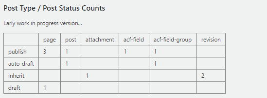
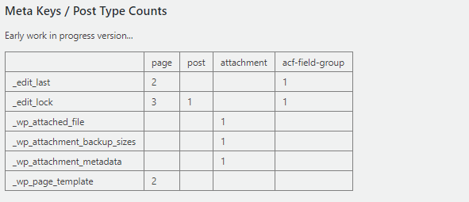
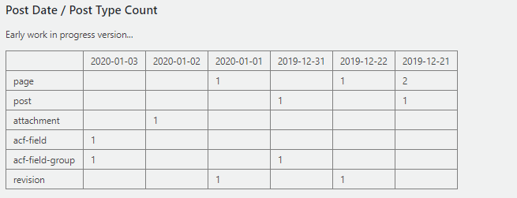
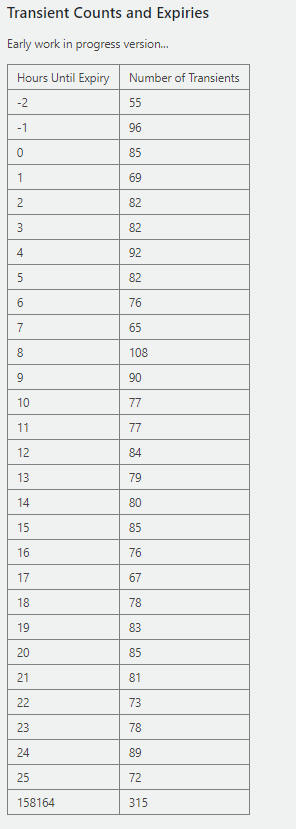

\[In Development\] A plugin to analyze a WordPress database and provide meaningful insights.

- Helps you see how your data is distributed. Ie. which post types, meta keys, transients, etc. are contributing to a large number of rows in one or more of your tables.
- Provides some insights into how your database evolved over time (using date columns for applicable tables)
- A good place to start when your database is large and you want to track down the culprit.
- If your a WordPress developer it will offer other benefits which I won't go into detail on at this point.  

Here are some early screenshots. The data is much more interesting when used on a very large and in production database.

Todos
- Count total rows in all tables (including table registered from plugins)
- Breakdown of users and user meta table (much less focus on this at the moment since the majority of sites have many posts and not many users).
- I have some other ideas for the options table.
- Graphs or other display types might be nice when displaying time series data (ie. post dates).
- We can probably generate a useful report on post modified dates as well.
- Additionally, we can combine revisions and post modified dates to give an idea of how many revisions are new and how many are ancient.
- A time series graph showing all insertions and modifications of all post types would be cool.
- Report of how many rows in each table serialize data using JSON or PHP serialization. (a table without any PHP serialized objects can safely use SQL find and replace statements)
- Analyze tables for cells containing very large amounts of data.
- I'm sure there are lots more things we could do... If I get this live and people use it, I'm hoping that their feedback will spark new ideas.