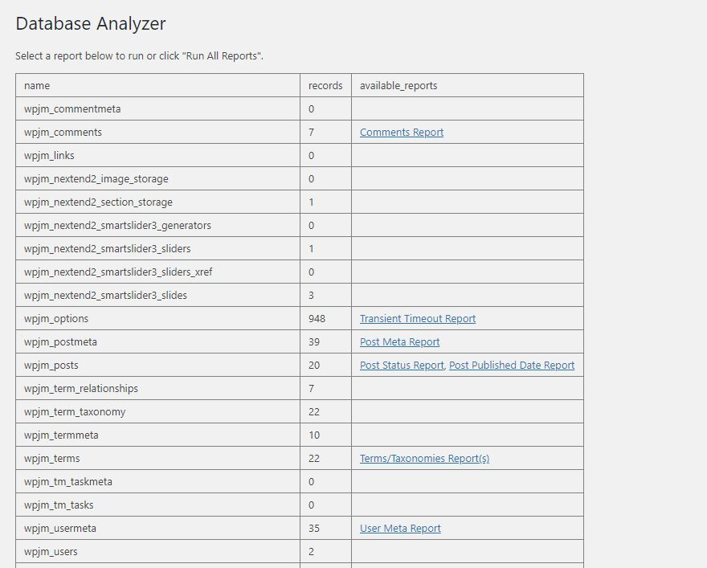
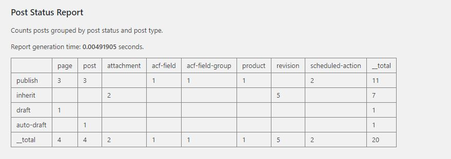
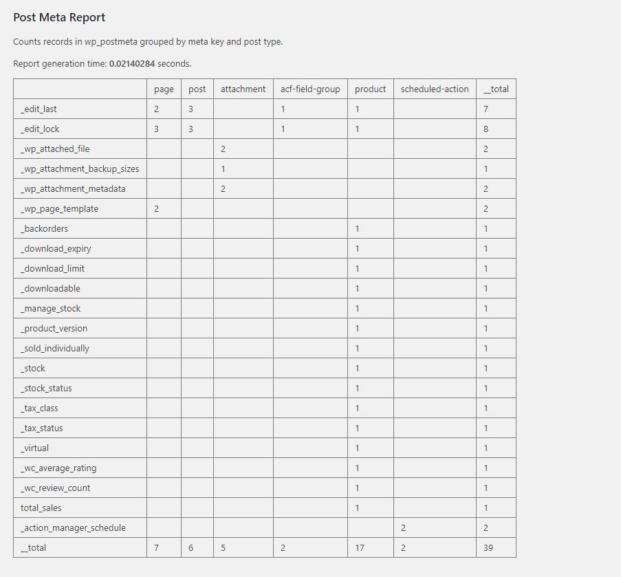
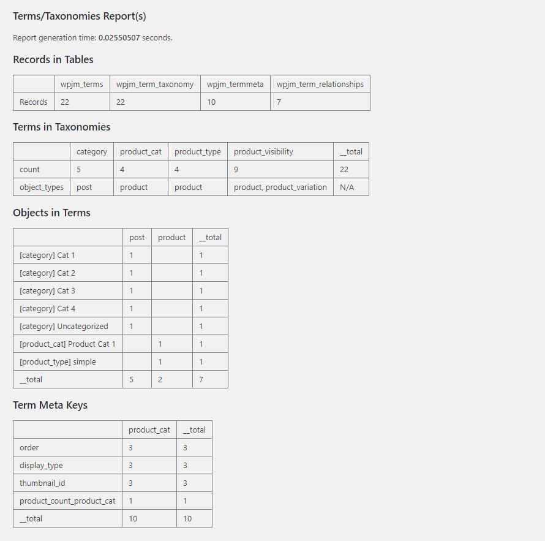
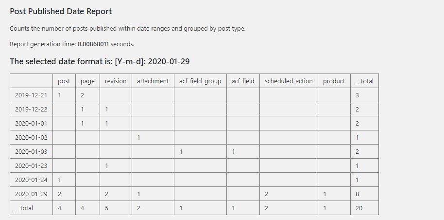

A WordPress plugin to report on the size and structure of your database.

This plugin is somewhat geared towards developers. The results will be more meaningful if you have a basic
understanding of how the WordPress database works.

This plugin will:
- Read your database to generate reports.
- Provide insight on why your database is large.

This plugin will not:
- Update or delete from your database in an attempt to optimize it.

### Screenshots

### Deploying

Roughly how I (plan to) push releases from git to svn

- Push changes to git and then clone into a new directory (effectively removing git ignored files)
- Composer install --prefer-dist (note: bower used to compile scss only, so bower install is not needed here)
- delete .git
- A few other files could be deleted manually, but I probably won't do this
- what you have left is the WordPress plugin to be deployed
- note: no need to compile scss. master.css is intentionally not git ignored.
- note: I do this with each new release, not every developement change.
